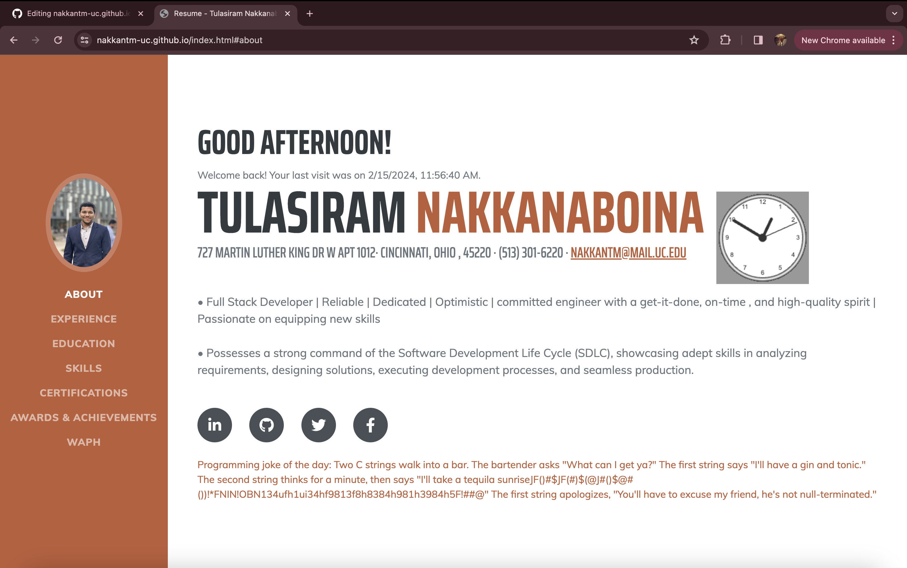

# WAPH-Web Application Programming and Hacking

## Instructor: Dr. Phu Phung

## Student

**Name**: Tulasiram Nakkanaboina

**Email**: nakkantm@mail.uc.edu


## Individual Project 1 - Professional Profile Website

**Overview**: This Project deals with developing a front-end web development with a professional profile website on github.io cloud service.
As part of this, I have developed a personal portfolio and deployed it on GitHub cloud. The technical requirements includes using basic javaScript code , JQuery, and react library. Two public web APIs are integrated and JavaScript cookies are utilized to remember the user and greet them when they revisit the website.
Non-technical requirements inludes using an open-source bootstrap frame work and Google analytics page tracker is added as well.

Link to the repository:
[https://github.com/nakkantm-uc/nakkantm-uc.github.io/blob/main/README.md](https://github.com/nakkantm-uc/nakkantm-uc.github.io/blob/main/README.md)

\pagebreak

To create the personal portfolio i have downloaded a predefined bootstrap template from [https://startbootstrap.com/theme/resume](https://startbootstrap.com/theme/resume) and customized it as per the project requirements. This portifolio consists of professional profile with my resume, including name, headshot, contact information, background, e.g., education, my experiences and skills. Additonally, a link to new HTML page to show case the Hackathons , Labs which are completed as part of WAPH course work has been added.




\pagebreak

A Google analytics page tracker has been integrated into this portfolio to monitor the traffic and stats .

```JS
<!-- Google tag (gtag.js) -->
<script async src="https://www.googletagmanager.com/gtag/js?id=G-736JEW5RXQ"></script>
<script>
  window.dataLayer = window.dataLayer || [];
  function gtag(){dataLayer.push(arguments);}
  gtag('js', new Date());

  gtag('config', 'G-736JEW5RXQ');
</script>
```


\pagebreak

The techstack used for this portfolio is HTML, CSS, Bootstrap framwork,JavaScript and React library.
Using JQuery to public APIs were integrated which are random joke generator web service and Weather widget web service.
A random joke is displayed for every minute.
```JS
<script>
function displayJoke(){
	$.get("https://v2.jokeapi.dev/joke/Programming?type=single",function(result){
				console.log("from joke API: "+ JSON.stringify(result));
				if (result && result.joke) {
				$("#response").text("Programming joke of the day: " +result.joke);
				}
				else{
				 $("#response").text("Could not retrieve a joke at this time.");	
				}
			});
		}
		displayJoke();
		setInterval(displayJoke,60*1000);
</script>
```

Weather Widget code: 
```JS
<div class="weather-widget">
<a class="weatherwidget-io"
 href="https://forecast7.com/en/39d10n84d51/cincinnati/"
	data-label_1="CINCINNATI" data-label_2="WEATHER"
 	data-theme="original" >CINCINNATI WEATHER</a>
<script>
		!function(d,s,id){var js,fjs=d.getElementsByTagName(s)[0];
		if(!d.getElementById(id)){js=d.createElement(s);js.id=id;
		js.src='https://weatherwidget.io/js/widget.min.js';
		fjs.parentNode.insertBefore(js,fjs);}}
(document,'script','weatherwidget-io-js');
</script>
</div>
```


Moreover some of the code from lab 2  to include digital clock, analog clock and to show/hide email has been added.

\pagebreak

To make the portfolio interesting i have add a custom greeting message using react. This code helps in greeting the user Good Morning , Good evening , Good afternoon based on the time of the day.

```JS
<head>
<script src="https://unpkg.com/react@17/umd/react.development.js"></script>
<script src="https://unpkg.com/react-dom@17/umd/react-dom.development.js"></script>
</head>

<div id="greeting-root"></div>
<script src="greetings.js"></script>

const Greeting = () => {
  const hour = new Date().getHours();
  let greetingMessage;

  if (hour >= 5 && hour < 12) {
    greetingMessage = 'Good morning!';
  } else if (hour >= 12 && hour < 17) {
    greetingMessage = 'Good afternoon!';
  } else {
    greetingMessage = 'Good evening!';
  }

  return React.createElement('h2', null, greetingMessage);
};

ReactDOM.render(React.createElement(Greeting, null),
document.getElementById('greeting-root'));
```

\pagebreak

JavaScript cookies are utilized to remember the user . If they visit the website first time "welcome to my portfolio is displayed" otherwise "welcome back to my portfolioi and time" are displayed.

```JS
<script>
<div id="greetingCookie"></div>
function setCookie(name, value, expiryDays) {
            const d = new Date();
            d.setTime(d.getTime() + (expiryDays*24*60*60*1000));
            let expires = "expires="+ d.toUTCString();
            document.cookie = name + "=" + value + ";" + expires + ";path=/";
        }

        function getCookie(name) {
            let cookieName = name + "=";
            let decodedCookie = decodeURIComponent(document.cookie);
            let ca = decodedCookie.split(';');
            for(let i = 0; i <ca.length; i++) {
                let c = ca[i];
                while (c.charAt(0) == ' ') {
                    c = c.substring(1);
                }
                if (c.indexOf(cookieName) == 0) {
                    return c.substring(cookieName.length, c.length);
                }
            }
            return "";
        }

        function welcomeUser() {
            const lastVisit = getCookie("lastVisit");
            const greetingElement = document.getElementById("greetingCookie");
            if (lastVisit) {
                greetingElement.innerHTML =
		 "Welcome back! Your last visit was on " + lastVisit + ".";
            } else {
                greetingElement.innerHTML = "Welcome to my portfolio!";
            }
            const now = new Date();
            setCookie("lastVisit", now.toLocaleString(), 365);
        }

        welcomeUser();
</script>
```


****************************  END  ***********************
